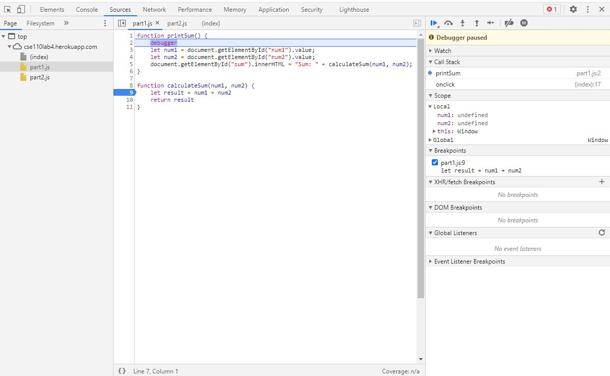

### What was the bug?
num1 and num2 are strings, so the '+' operator concatenates these two together instead of adding them. 

### How would you fix it?
I type casted num1 and num2 to number so the '+' operator now acts like a plus sign and the correct result gets stored.

### Screenshots for Breakpoint and Watch

### What is the name of the new json file?
The name is citylots.json

### Which file initiated the download of the new file?
part2.js at line 2

### What is its file size?
11.7 MB

### How long did it take to download?
3.10s

### What was your User-Agent for the browser that made the request?
Mozilla/5.0 (Windows NT 10.0; Win64; x64) AppleWebKit/537.36 (KHTML, like Gecko) Chrome/88.0.4324.104 Safari/537.36

### In the response, what type of server did it come from?
Apache

### When was the file last modified?
Tue, 26 Jan 2021 22:14:13 GMT

### What was the Content-Type of the file?
application/json

### Which method inside the initiating file made the request?
fetchData()